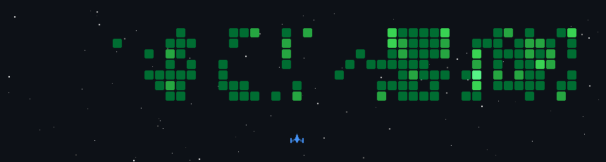

# 
 Hi, I'm Ricardo Ramirez (Richixs) 🐧

### 
Fullstack & Mobile Developer · Build, Ship, Learn, Repeat

### About me

	
  I am a Computer Science student at UMSS and a Full‑Stack & Mobile Developer. I enjoy turning ideas into production-ready products through rapid prototyping, open source, and collaboration at hackathons and game jams. I am also a volunteer firefighter and I aim to apply technology to create positive community impact.

### Contact & Social Media

- ✉️ Email: <a href="mailto:ricardo@richixs.dev" target="_blank" rel="noopener noreferrer">ricardo@richixs.dev</a>
- 💼 LinkedIn: <a href="https://www.linkedin.com/in/richixs" target="_blank" rel="noopener noreferrer">richixs</a>
- 🎥 YouTube: <a href="https://www.youtube.com/@ricky598" target="_blank" rel="noopener noreferrer">RCRicky598</a>
- 🎮 Twitch: <a href="https://www.twitch.tv/rcrichixs" target="_blank" rel="noopener noreferrer">rcrichixs</a>
- 📸 Instagram: <a href="https://www.instagram.com/cricky598" target="_blank" rel="noopener noreferrer">@cricky598</a>

	

